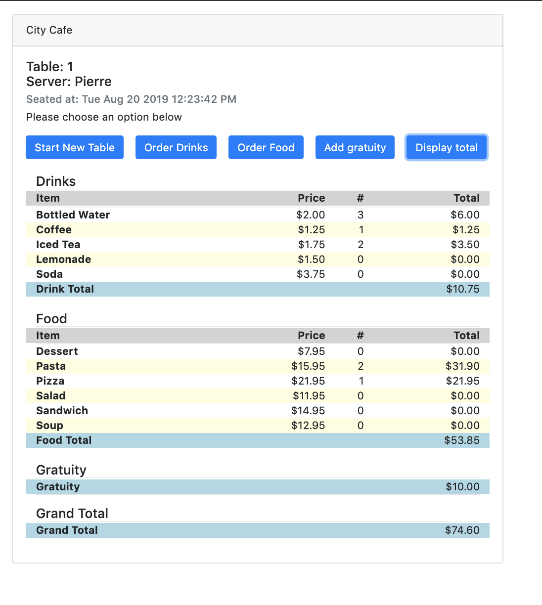

# JavaScript Restaurant POS

This project was for the Full Stack Developer bootcamp I did and was for a lesson on .

## Assignment
> Create a basic html file.
>
> ● You are required to create a cafe bill calculator with the following specifications:
>> o Create a drinks object for drink items on the menu (create at least 5 options and give them prices as values)
>>
>> o Create a food object for food items on the menu (create at least 5 options and give them prices as values)
>>
>> o Using a prompt box, display the drink items and let the user enter an option (add the price to a total)
>>
>> o Using a prompt box, display the food items and let the user enter an option (add the price to a total)
>>
>> o Using a prompt box, ask the user how much they want to tip (add this to the total)
>>
>> o Finally, create an alert to display the total of the bill to the user

## Running the Code

[Clone / Download](https://github.com/dh4u/bootcamp-restaurant-POS) the project to your computer and open index.html in your browser.
